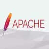
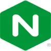
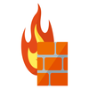
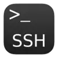

# Deliverable 1 Submission

## Basic Terminology 

### What is a Apache? 
Open-source web server software that is developed and maintained and it's free.

### What is a Web Server? 
Software and hardware that uses HTTP and other protocols.

### What is a ServerAlias? 
Alternate names for a host used when matching requests to name-virtual hosts.

### What is a OpenSSH? 
open-source implementation of the SSH. SSH is a network protocol that allows secure communication over an unsecured network. 

### What is a web server? Hardware and software side
Hardware, is a computer that stores the CSS stylesheets, JavaScript files, HTML documents, and image files that make up a website. A web server establishes a connection with the Internet and facilitates the exchange of physical data with other web-connected devices.
Software, is a web server that includes parts that controls access hosted files. HTTP is a software protocol that you use on your browser webpage. HTTP server has domain names of websites that stores and delivers. 
### What are some different web server applications?

#### Apache
 
Free open-source HTTP server for modern operating systems including UNIX and Windows. The project is to provide a HTTP secure service in sync with the current HTTP standards. 
#### Lighttpd
 
Free open-source that provides high-performance web server software designed for speed, security, and flexibility. It suitable for both Windows and Linux and consumes minimal CPU and RAM. Lighttpd was released in 2003 by a German software developer.
#### Nginx
 
Free open source web server that includes reverse proxy, load balancing, mail proxy, and HTTP cache capabilities. It also functions as a proxy server for email communications protocols, such as IMAP, POP3, and SMTP. 
### What is virtualization?
Technology that allows you to model servers, storage, networks, and other physical machines virtually. A single physical machine to act as multiple virtual computers.Guest OS or data storage is abstracted away from the true underlying hardware or software.

### What is virtualbox?
 
It allows users to extend their existing computer to run multiple operating systems including Microsoft Windows, Mac OS X, Linux, and Oracle Solaris, at the same time.
### What is a virtual machine?
Software-based emulation of a physical computer. It allows you to run multiple operating system on a single physical machine.

### What is Ubuntu Server?
 
Ubuntu operating system open-source software created especially for server environments is called Ubuntu Server. Based on Debian, Ubuntu is a well-known open-source Linux distribution. Ubuntu server is designed for server activities including web hosting, file hosting, and application hosting.

### What is a firewall?
 
A software or hardware based network security system that allows or denies network traffic to a set of rules. Basically act like a filter and stops untrusted network traffic or packets. It protects the network from external attacks.

### What is SSH?
 
A network protocol for secure data communication remote shell services or command execution between two networked computers. It provides to include login to remote machine, SSH keys which is private and public keys. 