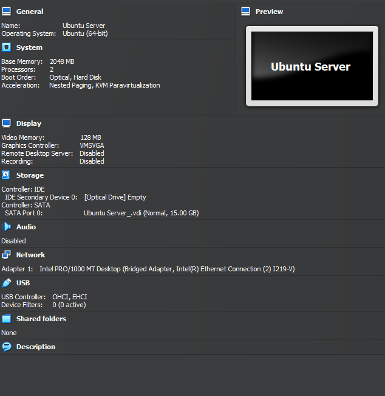
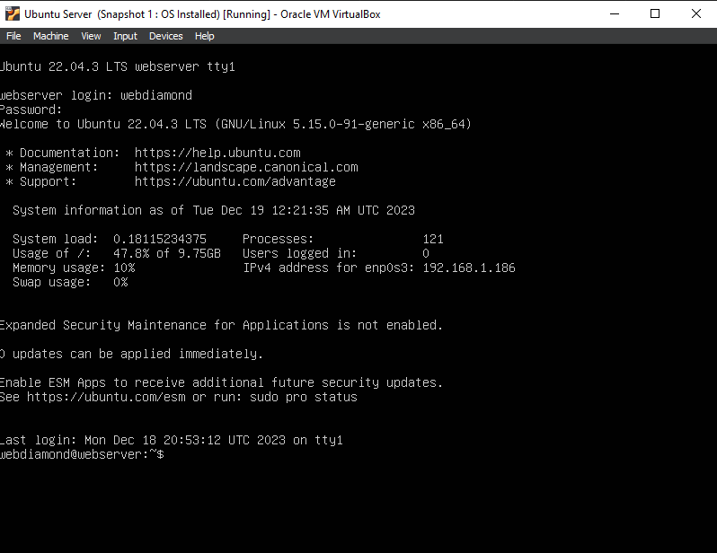
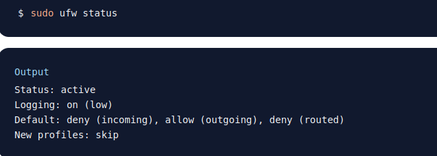
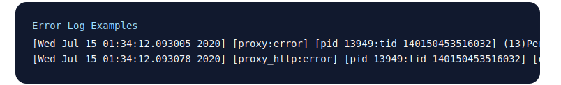

### What are the server hardware specifications (virtual machine settings)? Take a screenshot - don’t type it!

### What is Ubuntu server log in screen? Take screenshot - do not type it!

### What is the IP address of your Ubuntu Server Virtual Machine?
My IP address for Ubuntu Server `192.168.1.186`
### How do you enable the Ubuntu Firewall?
This command enable firewall `sudo ufw enable` 

### How do you check if the Ubuntu Firewall is running?
This command check status firewall `sudo ufw status`

### How do you disable the Ubuntu Firewall?
To disable Ubuntu firewall `sudo UFW disable`
### How do you add Apache to the Firewall?
This command is to add firewall `sudo ufw allow 'Apache'`
### What is the command you used to install Apache?
This command is to install Apapche `sudo apt install apache2 -y`
### What is the command you use to check if Apache is running?
Allow to check if Apache still running `sudo systemctl status apache2 --no-pager`
### What is the command you use to stop Apache?
Stop Apache `sudo systemctl stop apache2`
### What is the command you use to restart Apache?
Allow to restart Apache `sudo systemctl restart apache2`
### What is the command used to test Apache configuration?
To test Apache configuration `sudo apachectl -t`
### What is the command used to check the installed version of Apache?
Check the Apache installed version `sudo apache2 -v`
### What are the most common commands to troubleshoot Apache errors? Provide a brief description of each command.
This command checks the Apache configuration files for syntax errors. `apachectl configtest` 
### Which are Apache Log Files, and what are they used for? Provide examples and screenshots.
Troubleshooting Apache on a Fedora `/var/log/httpd/error_log` 
