# Week Report 6

## Wildcards.

### * Wildcard
The * wildcard from 0 to any number of characters. 
*Example: 
    *List all the text file in a directory. 
        *`ls *.txt`  
    *List all the file that start with the word file.
        *`ls file`
    *Copy all the .mov files
        *`cp Downloads/ *.mov ~Video/films/`     

### ? Wildcard 
The ? wildcard matches a single character.
* Example:
    *List all files that have 4 characters and are followed by the word file in the name.

    *List all files that have 3 characters and are followed by the word file in the name.
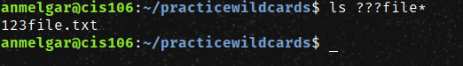
    *List all files that have 5 characters and are followed by the word file in the name.
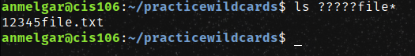

### [] Wildcard
The [] wildcard matches a single character.
*Example:
    *List all files that have a vowel after f. 
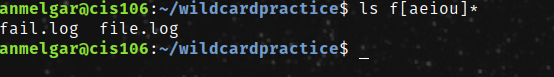
    *List all files that have range of letters after s.
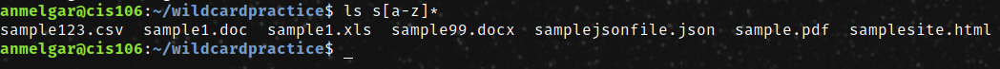
    *List all files whose name has at least one number:
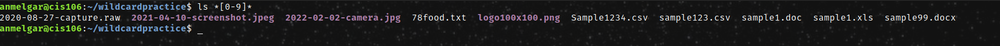

### Brace Expansion
*Example:
    *Create a whole directory structure in a single command.
 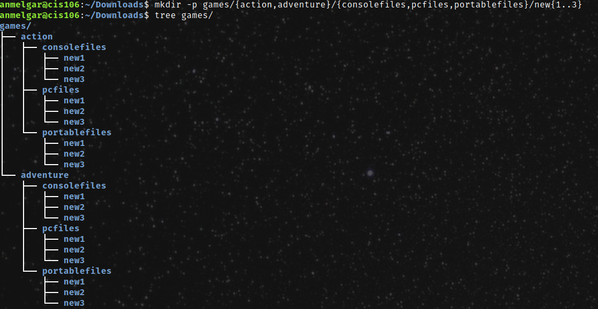 
 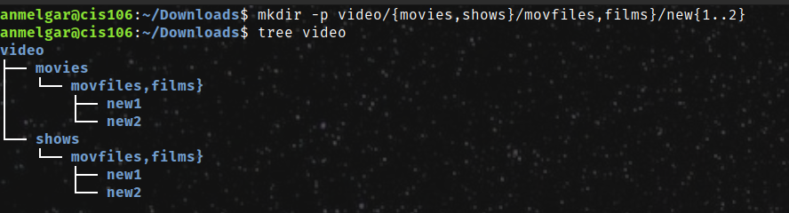  
 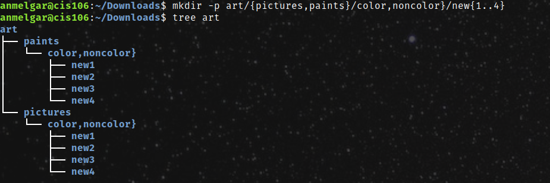

## Practice 5
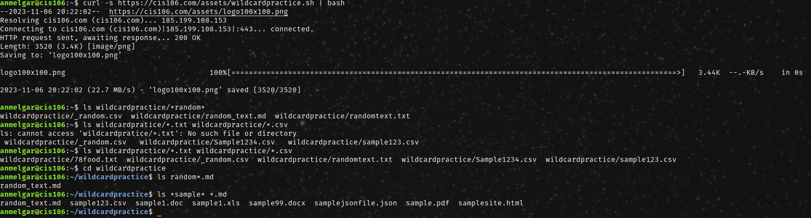

## Practice 6
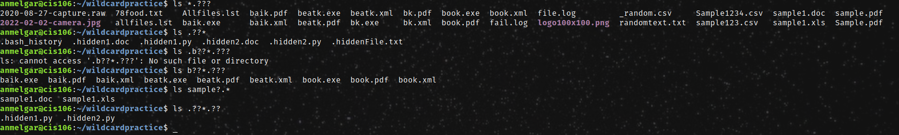
## Practice 7
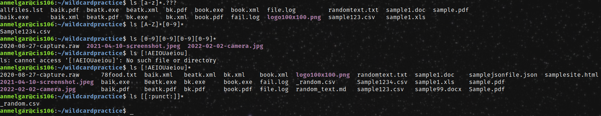
