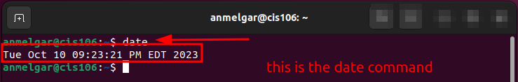
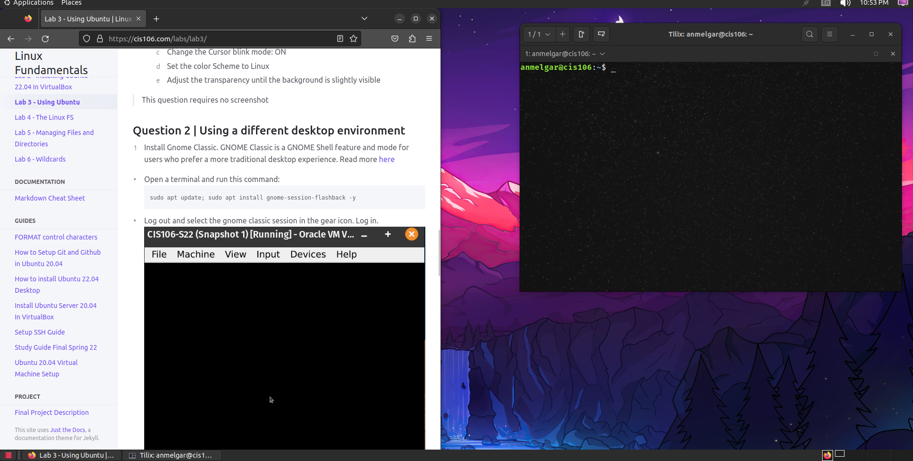

name: Anthony Melgar
course: cis 106
semester: Spring 23

# Lab 3 Submission

## Question 1 

## Question 2 

## Question 3 

| Program purpose  | Package Name | Version            |
| ---------------- | ------------ | ------------------ |
| blockattack      | 9,390 kB     | 2.7.0-1            |
| dragonplayer     | 99.0 MB      | 4:21.12.3-0ubuntu1 |
| epiphany-browser | 121 MB       | 42.4-0ubuntu1      |
| geary            | 13.7 MB      | 40.0-2             |
| ario             | 1,994 kB     | 1.6-1.1            |

## Question 4

| command | what it does               |
| ------- | -------------------------- |
| echo    | display a string           |
| fortune | tells you a fortune        |
| cowsay  | cow picture with a message |
| lolcat  | rainbow text colors        |
| figlet  | ASCII bubble text          |
| toilet  | ASCII render text          |
| rig     | create a fake identity     |