# Week Report 4

## Practice from the presentation the Linux File System:

### Practice 1
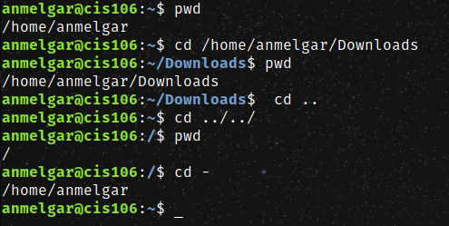 
### Practice 2 
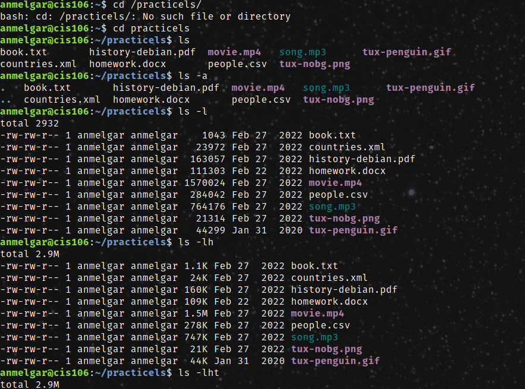 
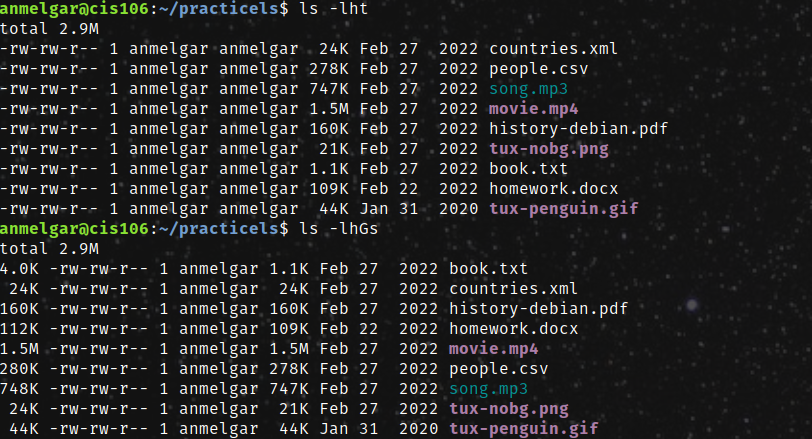 
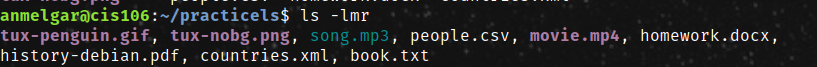 
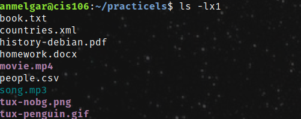 
### Practice 3
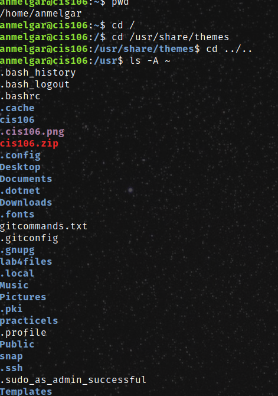
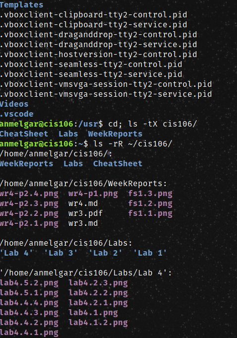
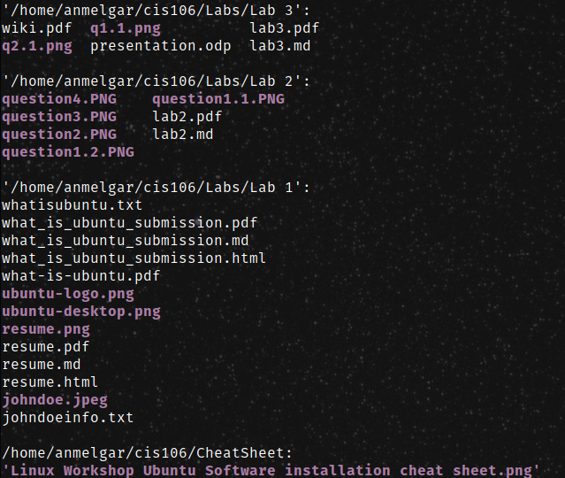
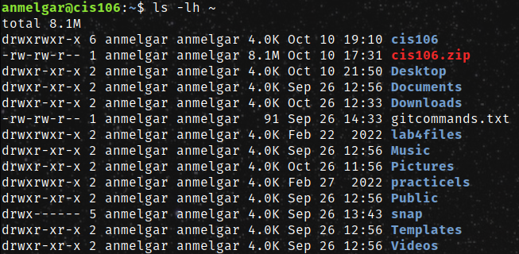
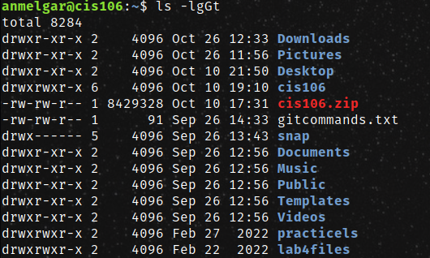

## The Linux File system directories and their purpose:

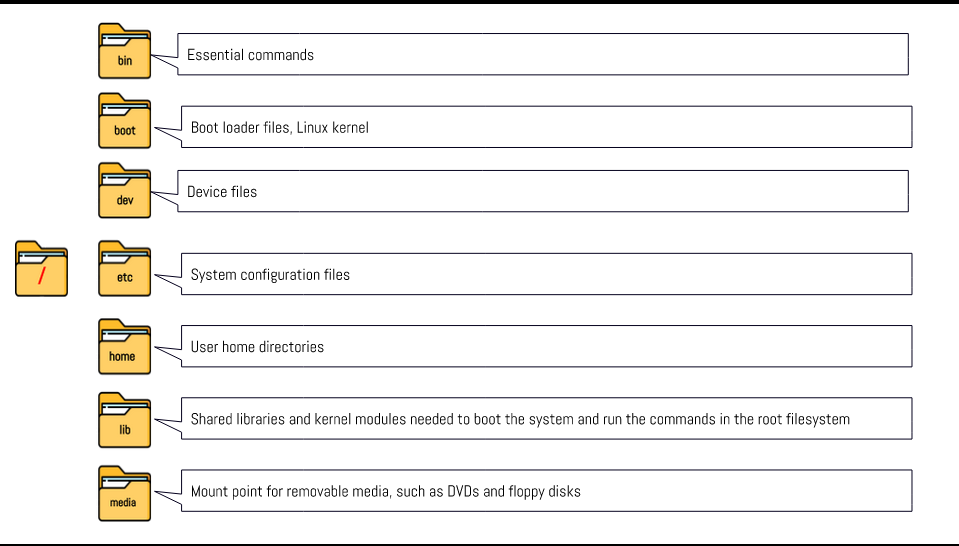 
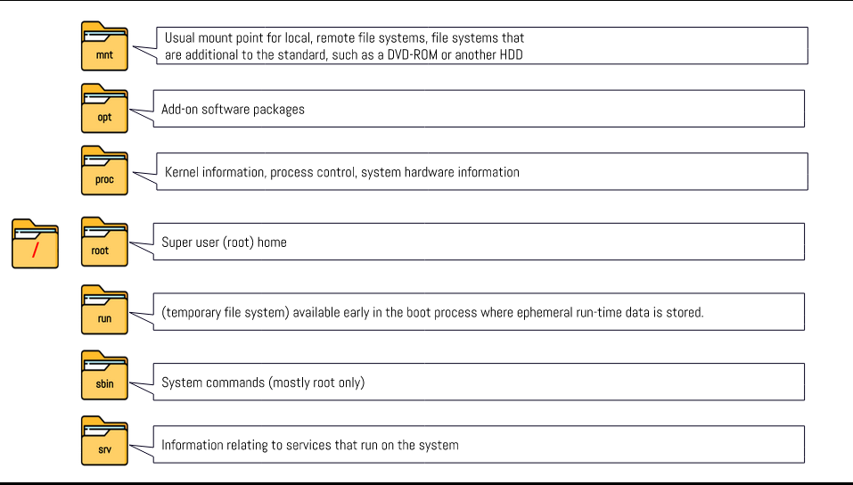 
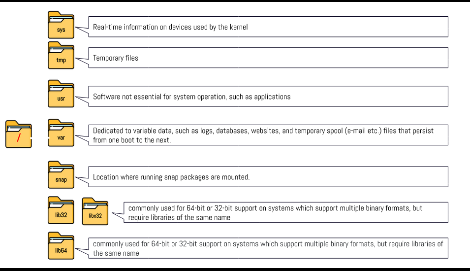 
## All the commands for navigating the filesystem 

| Command | What it does                                      | Syntax                          | Example             |
| ------- | ------------------------------------------------- | ------------------------------- | ------------------- |
| pwd     | prints current directory                          | pwd                             | pwd               |
| cd      | current working directory                         | cd + destination                | cd + Download         |
| ls      | list the content of the present working directory | ls + option + directory to list | ls + -t ~/Documents |
## Basic terminology

**File system:** The way files are stored and organized.
**Current directory:** Directory where you at.
**parent directory:** Working inside a particular. directory. You can move forward or backwards directories.
**the difference between your home directory and the home directory:** current working(home) and root of directory.
**pathname:** file that indicates the location of a file. 
**relative path:** location of a file starting at the root. 
**absolute path:** location of a file starting current working directory.
