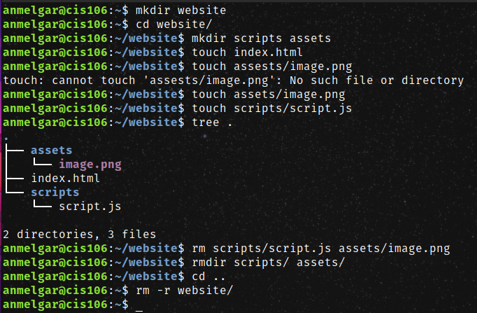
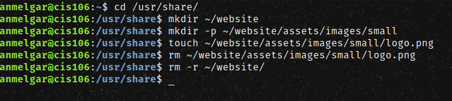
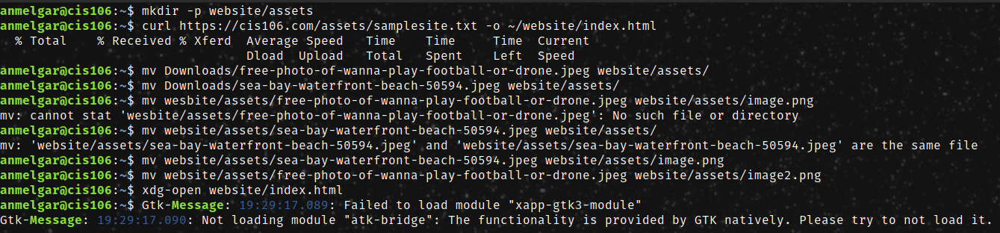
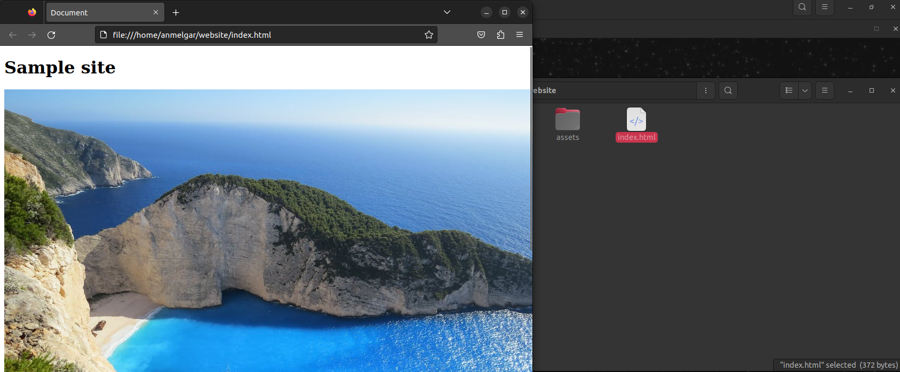
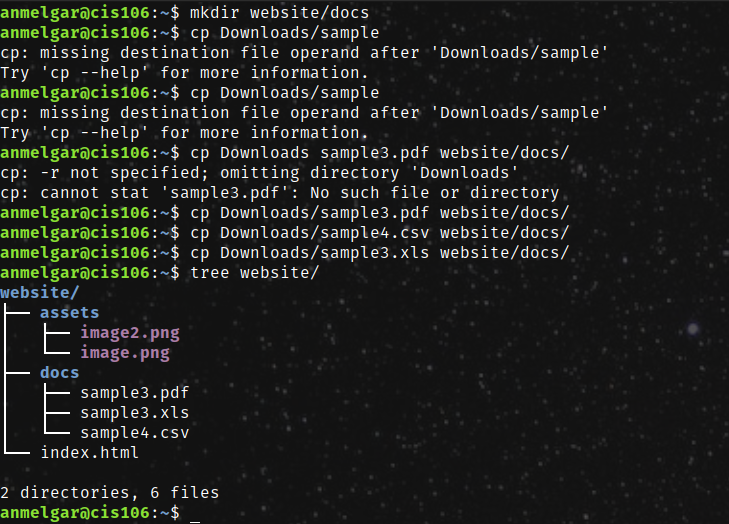

# Week Report 5

## Answer to Question:

**What are Command Options?**
Commands are often followed by options that modify/enhance their behavior.  

**What are Command Arguments?** 
Arguments which are the items the command acts on. This can be a file or directory.

**Which command is used for creating directories? Provide at least 3 examples.**
The command is mkdir.
* Example 1.
  * Create a directory: `mkdir fruits`
* Example 2.
* Create multiple directories. `mkdir music ~Downloads/videos ~Downloads/work`
* Example 3.
  * Create multiple directories. `mkdir games ~Downloads/songs ~Downloads/graphic`

**What does the touch command do? Provide at least 3 examples.**
* Example 1.
  * Create a file list.
    * touch list
* Example 2.
* Create absolute path. `touch ~Downloads/iPhone.txt`
* Example 3.
* Create relative path. `touch Downloads/iPhone3.txt`

**How do you remove a file? Provide an example.**
* Example 1.
  * Remove a file. `rm shows`
* Example 2. 
  * Remove a file and prompt confirmation. `rm -i movies`
* Example 3. 
  * Remove all files inside a directory before removing more than 3 files. `rm -I Downloads/music/*` 

**How do you remove a directory and can you remove non-empty directories in Linux? Provide an example**
* Remove an empty directory. `rmdir Downloads/music`
* Remove an non-empty directory. `rm -r Downloads/music`

**Explain the mv and cp command. Provide at least 2 examples of each**

* Example 1. 
    *mv command. `mv music/song`
* Example 2. `mv Downloads/music.mp3 Documents/`
* Example 1. `cp shows/movies` 
* Example 2. `cp Downloads/Background/* ~Pictures/`
  
  ## Practice 1
   
  ## Practice 2 
   
  ## Practice 3
   
   
  ## Practice 4
   